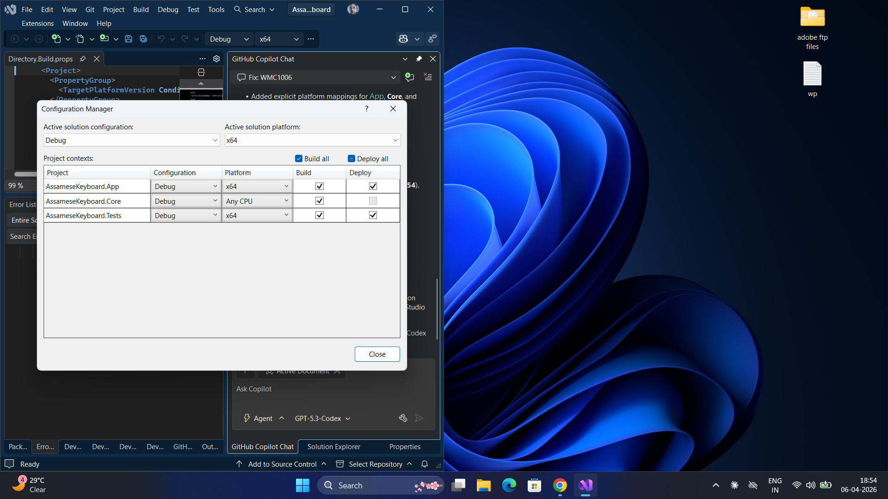

# Assamese Keyboard (Experimental)

A Windows desktop Assamese keyboard input app built with WinUI 3 on .NET 8.

## Features

- System-wide keyboard interception and Assamese text injection.
- Assamese layout mapping loaded from embedded JSON.
- Tray-based control surface (enable/disable, settings, exit).
- Settings and reference pages in WinUI UI.
- Unit tests for mapping logic.

## Tech Stack

- .NET 8 (`net8.0-windows10.0.19041.0`)
- WinUI 3 (`Microsoft.WindowsAppSDK`)
- Dependency injection + logging (`Microsoft.Extensions.*`)
- `H.NotifyIcon.WinUI` for tray icon support
- MSTest for tests

## Project Structure

- `AssameseKeyboard.App` — WinUI desktop application
- `AssameseKeyboard.Core` — keyboard hook, mapping, injection, services
- `AssameseKeyboard.Tests` — unit tests

## Prerequisites

- Windows 10/11
- .NET SDK 8.x installed
- Visual Studio 2026 (or compatible) with .NET desktop workload

## Build

From solution root:

- Build app:
  - `dotnet build .\AssameseKeyboard.App\AssameseKeyboard.App.csproj -p:Platform=x64`
- Build core:
  - `dotnet build .\AssameseKeyboard.Core\AssameseKeyboard.Core.csproj`
- Build tests:
  - `dotnet build .\AssameseKeyboard.Tests\AssameseKeyboard.Tests.csproj -p:Platform=x64`

## Run (Visual Studio)

1. Open the workspace in Visual Studio.
2. Set `AssameseKeyboard.App` as Startup Project.
3. Use profile: `AssameseKeyboard.App (Unpackaged)`.
4. Press `F5`.

## Test

Run tests with:

- `dotnet test .\AssameseKeyboard.Tests\AssameseKeyboard.Tests.csproj -p:Platform=x64`

## Assets

Tray icons are expected at:

- `AssameseKeyboard.App/Assets/tray-on.ico`
- `AssameseKeyboard.App/Assets/tray-off.ico`

## Notes

- Project is configured for unpackaged debug run in current setup.
- If Visual Studio caches old launch settings, close and reopen the solution.

## Output Screenshot

Example Assamese typing output:

## License

This project is licensed under the GNU General Public License v3.0.
See `LICENSE` for details.
